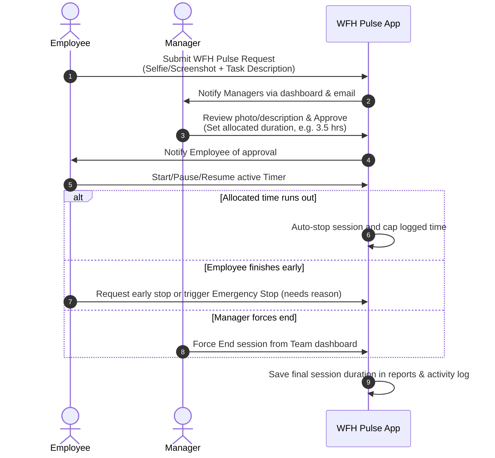

# WFH Pulse — WFH Tracker: Client User Guide

Welcome to the **WFH Pulse — WFH Tracker** application user guide! This system is designed to streamline and verify Work From Home (WFH) sessions, allowing employees to request work allocations with visual confirmation, and helping managers track active working hours in real time.

This guide provides step-by-step instructions for all user roles: **Employees**, **Managers**, and **System Administrators**.

---

## ── System Overview & Workflow ──

At its core, **WFH Pulse** operates on a **Request-Approval-Track** lifecycle:

---

## ── 1. Guide for Employees ──

As an employee, your daily routine consists of sending a check-in pulse, waiting for approval, and running your work timer.

### Step 1.1: Requesting a WFH Session (The "Pulse")
Before you can log any time, you must initiate a **Pulse Request**:
1. Navigate to your **Dashboard**.
2. Click the **Request WFH Pulse** button (or go to `Workspace > Pulse Request` in the sidebar).
3. **Upload an Image**: Attach a selfie or a screenshot of your WFH setup/workstation (maximum size 5MB).
4. **Description**: Describe your key focus areas or tasks for this session (up to 500 characters).
5. Click **Submit**.

> [!NOTE]
> Once submitted, your request is in `Pending` status. Your manager is instantly notified to approve it. You cannot submit multiple requests at the same time.

### Step 1.2: Using the Active Timer
Once a manager approves your request, your dashboard transforms into the **Active Timer** console.

* **Start the Timer**: When you begin working, click **Start**. The timer will glow, and your status changes to **Active**.
* **Pause / Resume**: If you need to step away for a break (lunch, personal task), click **Pause**. This pauses the timer and logs your status as paused. Click **Resume** when you are back at your screen.
* **Stop Options**:
  * **Emergency Stop**: If something unexpected occurs (e.g., power cut, urgent leave), click **Emergency Stop**. You will be prompted to type a brief explanation. This stops your session immediately, and marks it as completed.
  * **Request Early Stop**: If you completed your tasks ahead of the allocated time and want to close the session normally, click **Request Stop**. This sends a notification to managers to review and formally close your session.

> [!TIP]
> If your timer is running and you reach your allocated limit, the system will **automatically stop** the timer, save your time logs, and mark the pulse as completed.

### Step 1.3: Viewing Your History
Go to **My History** in the sidebar to review your past timesheets:
* Filter records by **Date From** and **Date To**.
* View a summary of your total lifetime hours worked.
* Examine the notes (e.g., "Auto-stopped", "Paused by user", or custom emergency reasons) for each log.

---

## ── 2. Guide for Managers ──

Managers oversee team pulses, assign work limits, track real-time activity, and download performance reports.

### Step 2.1: Managing Pulse Requests
When an employee sends a check-in request, a red badge appears on **Pulse Requests** in the sidebar:
1. Navigate to the **Pulse Requests** page.
2. Review the employee's submitted image and description.
3. Choose one of the options:
   * **Approve**: Fill in the **Duration** (Hours and Minutes) allocated for their task, then click **Approve**. This updates the employee's status and enables their timer.
   * **Reject**: Optionally enter a reason (e.g., "Invalid setup image", "Focus description lacks detail") and click **Reject**.

### Step 2.2: Live Team Monitoring
From the **Manager Dashboard**, you can monitor your team's live status:
* **Total Team Count**: Number of employees registered.
* **Today's Active Pulses**: Count of overall requested and approved sessions today.
* **Team Status Grid**: Shows each employee's name, their total accumulated time today, allocated time, active status (whether their timer is currently ticking), and if they've sent a Stop Request.
* **Force Reset Timer**: If an employee forgets to stop their timer or has finished working, you can click **Force Stop / Reset** on the dashboard. This immediately caps their log to the current elapsed duration and releases their session.

### Step 2.3: Generating Reports
Go to **Reports** in the sidebar to compile performance timesheets:
1. **Filters**: Search by employee name/email and filter by date range.
2. **Report Type**:
   * **Summary**: Shows high-level statistics (Employee name, email, total hours worked, total sessions logged, total pulse requests).
   * **Detailed**: Displays a granular breakdown of every session (Date, start/end times, exact duration, task description, pulse image thumbnail, and the manager who approved the session).
3. **Exporting**: Download the generated reports instantly by clicking:
   * **Export CSV** (for Excel/data analysis)
   * **Export PDF** (creates an A4 landscape report sheet)

---

## ── 3. Guide for System Administrators ──

System Administrators maintain system-wide users, link employees to managers, and oversee global system logs.

### Step 3.1: User Account Management
Go to **User Management** in the sidebar:
1. **Add Users**: Click **Add Manager** or **Add Employee**.
2. Fill in their username, email, password, and role.
3. **Manager Assignment**: When creating or editing an employee, you can assign them to a specific Manager who will handle their approvals.
4. **Deactivating Accounts**: You can click the **Toggle Status** button to temporarily activate or deactivate accounts. Deactivated users cannot log in.
5. **Editing/Deleting**: Modify profile information or permanently delete accounts (you cannot delete your own account).

### Step 3.2: Activity History Logs
Admins can oversee every single clock-in/out event in the system:
* Navigate to **Activity History**.
* Search logs by employee name.
* **Clear History**: Click **Clear Activity Logs** to wipe the tables for a new cycle (requires administrative confirmation).
* **Exporting**: Download the global log files as **CSV** or **PDF** for compliance auditing.

---

## ── Key Features ──

* **Instant Notifications**: You will notice a bell icon in the top right. AJAX polling checks for updates every 30 seconds. You receive instant updates when requests are submitted, approved, or terminated.
* **PWA Support**: The web app is fully installable on mobile devices or computers. You can add it to your home screen for quick mobile access, and it registers a background service worker to optimize performance.
* **Clean Dark Theme**: The system uses a modern dark aesthetic, featuring soft glassmorphic panels and responsive grids designed to look premium and feel fast on both desktops and mobile devices.

---

## ── FAQs & Troubleshooting ──

#### Q: What happens if an employee leaves their timer running and goes offline?
**A**: The timer is capped by the allocated duration approved by the manager. If the employee forgets to stop the timer, the system automatically stops it at the exact second the allocated hours finish. Additionally, a manager can click **Force Stop** from the manager dashboard to end the session at the current moment.

#### Q: What is the difference between Pause and Emergency Stop?
**A**:
* **Pause** allows the employee to freeze their timer temporarily (e.g., for a break). They can resume it later to consume the rest of their allocated hours.
* **Emergency Stop** shuts down the session permanently. It requires a text reason, caps the logged hours to the time spent, and changes the session status to `completed`, meaning it cannot be resumed.

#### Q: How do managers know there's a new request?
**A**: The navigation bar shows a real-time red badge with the number of pending requests, and managers receive real-time notifications via the bell icon in the top right corner.
